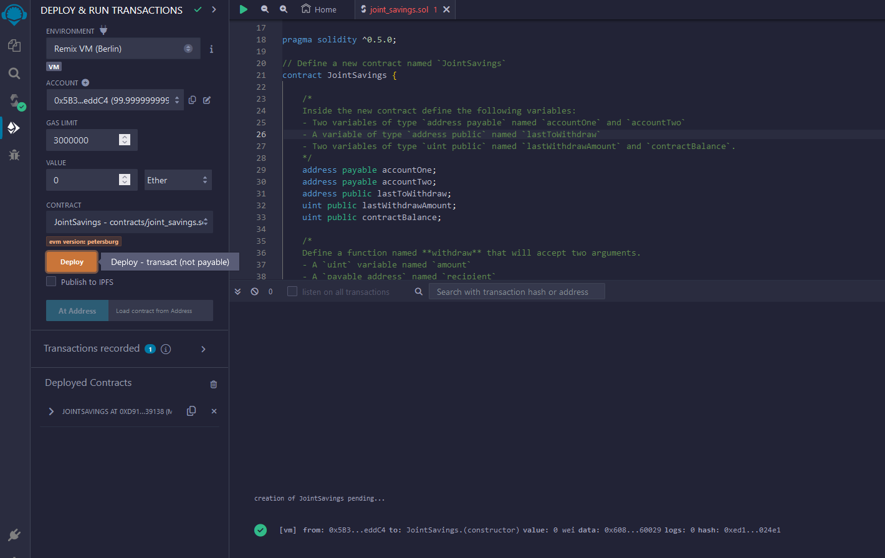
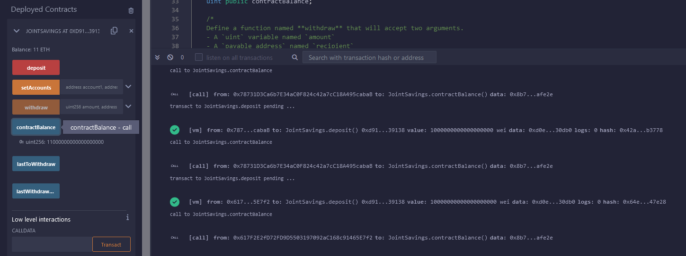

# Fintech Bootcamp - Solidity Challenge

## Summary

This repository contains the files for the module 20 homework assignment: solidity challenge.

## File description

### Primary Code

All of the primary code can be found in the Solidity file named "joint_savings.sol", which is located in this folder.

### Screenshots of Solidity Contract Execution

All of the screenshots of the Solidity contract execution can be found in the Execution_Results folder:

- 01_new_javascript_vm.png
- 02_after_contract_deployment.png
- 03_setting_the_accounts.png
- 04_contract_balance_0.png
- 05_first_deposit.png
- 06_contract_balance_1.png
- 07_second_deposit.png
- 08_contract_balance_11.png
- 09_third_deposit.png
- 10_contract_balance_16.png
- 11_first_withdrawal.png
- 12_contract_balance_11.png
- 13_second_withdrawal.png
- 14_contract_balance_1.png

## Solidity Contract Execution

The following images are examples of the contract in action.  Starting from a new virtual machine (VM):

The contract was deployed using the first account (at index 0), creating a joint savings account on the blockchain:

The same account (at index 0) spent the gas to set the individual withdrawal accounts to be the second and third accounts (located at indices 1 and 2, respectively):

Note that the initial contract balance is 0:

The fourth account (at index 3) is used to deposit 1 Ether to the contract:

Now the contract balance is 1 Ether in Wei:

The fifth account (at index 4) is used to deposit 10 Ether to the contract:

Now the contract balance is 11 Ether in Wei:

Finally, the sixth account (at index 5) is used to deposit 5 Ether to the contract:

Now the contract balance is 16 Either in Wei:

Note that Wei and Ether are interchangable.  1 ETH = 10^18 Wei, regardless of how you send or store it.

To demonstrate withdrawal into the individual accounts, the first account (at index 0) will be used to pay the gas.  The first withdrawal will be for 5 Ether, and it will be made into the second account (known as accountOne, at index 1).  Note that the balance of the second account has increased by 5 Ether:

Also note that the new contract balance is 11 Ether, and that the last deposit was 5 Ether into the the second account (ending in "5cb2"):

The same process will be used to demonstrate the withdrawal into the second account.  Once again, the first account (at index 0) is used to pay the gas.  The second withdrawal is for 10 Ether, and it will be made into the third account (known as accountTwo, at index 2).  Note that the balance of the third account has increased by 10 Ether:

Also note that the new contract balance is 1 Ether, and that the last deposit was 10 Ether into the third account (ending in "02db"):

These screenshots help illustrate the contract in action.  The contract was capable of receiving Ether and sending it to either of the two individual accounts authorized to make a withdrawal.